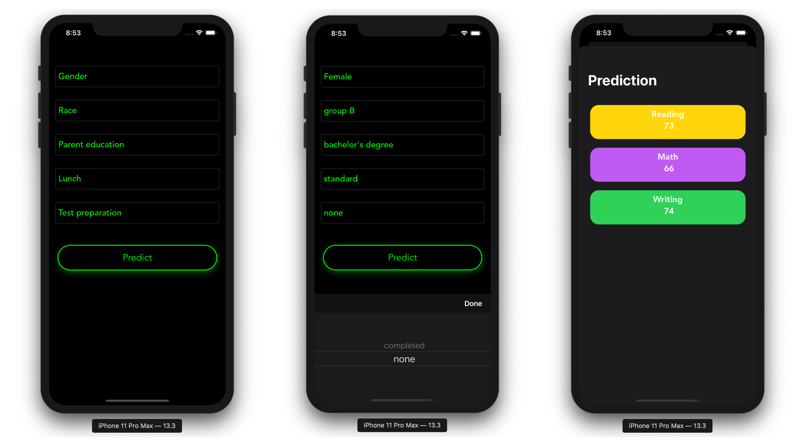

# Introduction to XGBoost with an Implementation on an iOS Application
> Train and deploy XGBoost models using coremltools and build an on-device experience using Swift and Core ML





All the python packages required are in the `requirements.txt` you just need to install them by running the following command in your shell:

```
pip install -r requirements.txt
```

## Train the model

MacOS, Linux:

```
python app.py
```

## About me

Omar MHAIMDAT – [Linkedin](https://www.linkedin.com/in/omarmhaimdat/) – omarmhaimdat@gmail.com

Distributed under the MIT license. See ``LICENSE`` for more information.

[Look at the rest of my repos](https://github.com/omarmhaimdat/)
